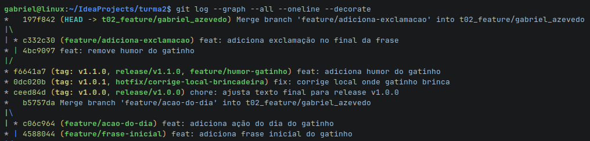
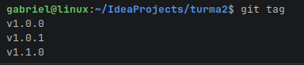

1 - Print do comando ```git log --graph --all --oneline --decorate```


2 - Print do comando ```git tag```  


3 - Breve explicação

- Diferença entre feature, release e hotfix?
    - feature é criada para desenvolver uma nova funcionalidade
    - release é criada para uma versão de preparação para produção, com ajustes finais e sem novas features
    - hotfix é criada diretamente da master para correção de algum bug em produção
- Por que hotfix sai da master?
    - Porque ela representa o código que está em produção naquele momento
- O que é versionamento semântico?
    - É um padrão para nomear as versões de software que utilizam o formato MAJOR.MINOR.PATCH
    - MAJOR: quando houver mudanças grandes que podem gerar imcompatibilidade
    - MINOR: quando adicionar uma nova funcionalidade sem quebrar nada
    - PATCH: correção de bug pequeno que não gera problemas
- O que aprendeu sobre conflitos?
    - Um conflito acontece quando duas branches alteram o mesmo trecho do mesmo arquivo, e o Git não sabe qual versão
      manter, pausando o merge para que seja decidido qual trecho deve manter.