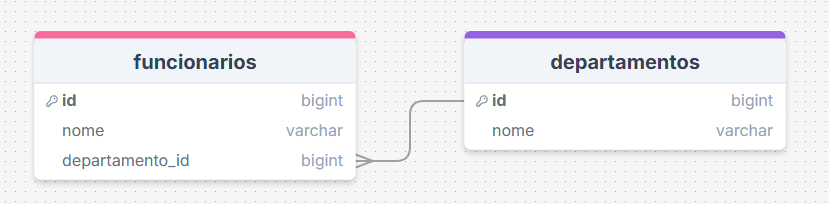
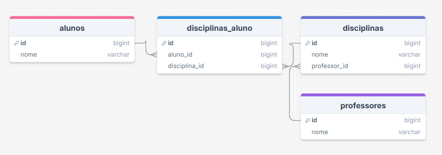

## Exercício 1 — Cliente e Pedido

1. Quais tabelas existem? 
- tabela *clientes* e tabela *pedidos*
2. Qual a cardinalidade?
- um para muitos(1:N)
3. Defina PK e FK
- clientes: PK = cliente_id
- pedidos: PK = pedido_id, FK = cliente_id

4. Faça um INNER JOIN

````sql
CREATE TABLE clientes (
  cliente_id SERIAL PRIMARY KEY,
  nome VARCHAR(100) NOT NULL
);

CREATE TABLE pedidos (
  pedido_id SERIAL PRIMARY KEY,
  cliente_id INT NOT NULL,
  FOREIGN KEY (cliente_id) REFERENCES clientes(cliente_id)
);

SELECT 
  c.cliente_id AS cliente_id,
  c.nome AS cliente,
  p.pedido_id AS pedido
FROM clientes c
INNER JOIN pedidos p ON c.cliente_id = p.cliente_id;
````


 ---

## Exercício 2 - Pedido e Produto

1. Qual o tipo de relacionamento?
- muitos para muitos(N:N)
2. Qual tabela intermediária criar?
- *itens_pedido*
3. Defina chave composta
- PK: itens_pedido_id
- PK: (pedido_id, produto_id)
4. Monte as tabelas

````sql
CREATE TABLE pedidos (
  id SERIAL PRIMARY KEY
);

CREATE TABLE produtos (
  id SERIAL PRIMARY KEY,
  nome VARCHAR(100) NOT NULL
);

CREATE TABLE itens_pedido (
  pedido_id INT NOT NULL,
  produto_id INT NOT NULL,
  quantidade INT NOT NULL,  
  PRIMARY KEY (pedido_id, produto_id),
  FOREIGN KEY (pedido_id) REFERENCES pedidos(id),
  FOREIGN KEY (produto_id) REFERENCES produtos(id)
);

SELECT 
  p.id AS pedido,
  pr.nome AS produto,
  ip.quantidade
FROM pedidos p
INNER JOIN itens_pedido ip ON p.id = ip.pedido_id
INNER JOIN produtos pr ON pr.id = ip.produto_id;
````


---


## Exercício 3 — Funcionário e Departamento

1. Qual a cardinalidade?
- um para muitos(1:N)
2. Onde fica a FK?
- fica na tabela *funcionarios*
3. Modele as tabelas


````sql
CREATE TABLE departamentos (
  id SERIAL PRIMARY KEY,
  nome VARCHAR(100) NOT NULL
);

CREATE TABLE funcionarios (
  id SERIAL PRIMARY KEY,
  nome VARCHAR(100) NOT NULL,
  departamento_id INT NOT NULL,
  FOREIGN KEY (departamento_id) REFERENCES departamentos(id)
);

SELECT 
  f.id AS funcionario_id,
  f.nome AS funcionario,
  d.nome AS departamento
FROM funcionarios f
INNER JOIN departamentos d ON f.departamento_id = d.id;
````



---

## Exercício 4 — Índices

1. Em quais colunas você criaria índices?
- coluna com FK de tabela cliente, coluna de data dos pedidos  
2. Por quê? 
- otimizar as consultas com filtros, joins, ordenações em tabelas muito grandes
---

## Exercício 5 — Sistema Escolar

1. Identifique relacionamentos
- alunos e disciplinas: muitos para muitos(N:N)
- professores e displinas: um para muitos(1:N)
2. Existe N:N?
- sim, entre alunos e displinas
3. Quais tabelas criar?
- alunos
- disciplinas
- disciplinas_aluno 
- professores
4. Monte o DER (imagem)



--- 

## Exercício 6 — Joins
1. Faça:
* INNER JOIN
* LEFT JOIN
2. Explique a diferença
- o INNER JOIN retorna os registros que aparecem nas duas tabelas
- o LEFT JOIN retorna os registros da tabela da esquerda

### Utilizando a tabela do exercício 1
INNER JOIN
````sql
SELECT 
  c.nome AS cliente,
  p.pedido_id AS pedido
FROM clientes c
INNER JOIN pedidos p ON c.cliente_id = p.cliente_id;
````

LEFT JOIN
````sql
SELECT 
  c.nome AS cliente,
  p.pedido_id AS pedido
FROM clientes c
LEFT JOIN pedidos p ON c.cliente_id = p.cliente_id;

````


