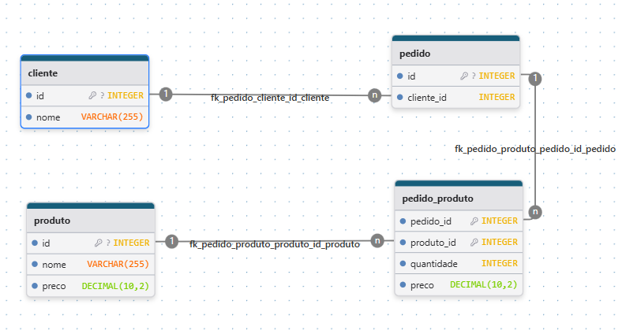
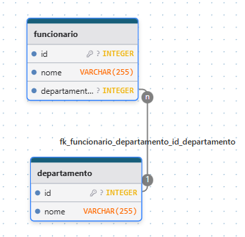

# Exercício 1 — Cliente e Pedido
### 1. Quais tabelas existem?
Cliente e Pedido

### 2. Qual a cardinalidade?
Cardinalidade: 1:N;

Um cliente pode ter vários pedidos, mas um pedido só pode ter um cliente.

### 3. Defina PK e FK
* PK: Cliente (id), Pedido (id)
* FK: Pedido (cliente_id)

### 4. Faça um INNER JOIN
```sql
SELECT
    pedido.id AS pedido_id,
    cliente.id AS cliente_id
FROM pedido
INNER JOIN cliente ON
    cliente.id = pedido.cliente_id
```


# Exercício 2 — Pedido e Produto
### 1. Qual o tipo de relacionamento? 
Relacionamento: N:N;

### 2. Qual tabela intermediária criar?
Tabela: pedido_produto
### 3. Defina chave composta
Chave composta: pedido_produto (pedido_id, produto_id)

### 4. Monte as tabelas
```sql
CREATE TABLE produto (
    id INTEGER GENERATED ALWAYS AS IDENTITY PRIMARY KEY,
    nome VARCHAR(255) NOT NULL,
    preco DECIMAL(10, 2) NOT NULL
);

CREATE TABLE pedido_produto (
    pedido_id INTEGER NOT NULL,
    produto_id INTEGER NOT NULL,
    quantidade INTEGER NOT NULL,
    preco DECIMAL(10, 2) NOT NULL,

    PRIMARY KEY (pedido_id, produto_id),

    FOREIGN KEY (pedido_id) REFERENCES pedido(id),
    FOREIGN KEY (produto_id) REFERENCES produto(id)
);
```

### Schema exercício 1 e 2



### Dúvidas:
1. Qual impacto real caso na tabela ``pedido_produto`` ao invés de usar ``PRIMARY KEY (pedido_id, produto_id)`` eu usar ``PRIMARY KEY (id)`` e criar um campo ``id`` auto-incremento com uma ``UNIQUE (pedido_id, produto_id)``?

# Exercício 3 — Funcionário e Departamento
### 1. Qual a cardinalidade?
Cardinalidade: N:1;

### 2. Onde fica a FK?
FK: funcionário (departamento_id)

### 3. Modele as tabelas



# Exercício 4 — Índices
### 1. Em quais colunas você criaria índices?
Criaria um índice na coluna ``cliente_id``

### 2. Por quê?
É a coluna que realiza o vínculo com o cliente, e é a coluna que será utilizada em consultas e joins