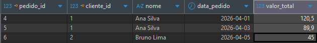
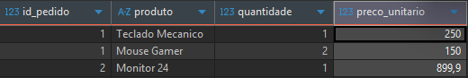
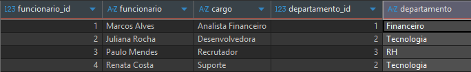
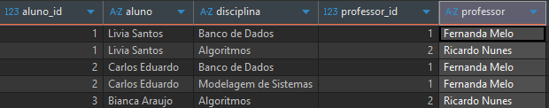

# Tarefa 04 - Modelagem de Banco de Dados

## Script inicial

```sql
CREATE DATABASE tarefa04;
```

## Exercicio 1 - Cliente e Pedido

1. Quais tabelas existem?

- clientes
- pedidos

2. Qual a cardinalidade?

- 1:N (um cliente pode ter varios pedidos)

3. Defina PK e FK

- PK: clientes(id), pedidos(id)
- FK: pedidos(id_cliente) -> clientes(id)

4. Faça um INNER JOIN

```sql
SELECT
    p.id AS pedido_id,
    c.id AS cliente_id,
    c.nome,
    p.data_pedido,
    p.valor_total
FROM pedidos p
INNER JOIN clientes c ON c.id = p.id_cliente;
```



## Exercicio 2 - Pedido e Produto

1. Qual o tipo de relacionamento?

- N:N (muitos para muitos)

2. Qual tabela intermediaria criar?

- pedidos_produtos

3. Defina chave composta

- PRIMARY KEY (id_pedido, id_produto)

4. Monte as tabelas

```sql
CREATE TABLE produtos (
    id SERIAL PRIMARY KEY,
    nome VARCHAR(120) NOT NULL,
    preco DECIMAL(10,2) NOT NULL
);

CREATE TABLE pedidos_produtos (
    id_pedido INT NOT NULL,
    id_produto INT NOT NULL,
    quantidade INT NOT NULL,
    preco_unitario DECIMAL(10,2) NOT NULL,
    PRIMARY KEY (id_pedido, id_produto),
    FOREIGN KEY (id_pedido) REFERENCES pedidos(id),
    FOREIGN KEY (id_produto) REFERENCES produtos(id)
);
```



## Exercicio 3 - Funcionario e Departamento

1. Qual a cardinalidade?

- 1:N (um departamento tem varios funcionarios)

2. Onde fica a FK?

- Na tabela funcionarios (departamento_id)

3. Modele as tabelas

```sql
CREATE TABLE departamentos (
    id SERIAL PRIMARY KEY,
    nome VARCHAR(120) NOT NULL
);

CREATE TABLE funcionarios (
    id SERIAL PRIMARY KEY,
    nome VARCHAR(120) NOT NULL,
    cargo VARCHAR(80) NOT NULL,
    departamento_id INT NOT NULL,
    FOREIGN KEY (departamento_id) REFERENCES departamentos(id)
);
```



## Exercicio 4 - Indices

1. Em quais colunas voce criaria indices?

- pedidos(id_cliente)
- pedidos(data_pedido)

2. Por que?

- id_cliente melhora consultas com JOIN por cliente.
- data_pedido melhora filtros por periodo e ordenacoes por data.

Exemplo:

```sql
CREATE INDEX idx_pedidos_id_cliente ON pedidos(id_cliente);
CREATE INDEX idx_pedidos_data_pedido ON pedidos(data_pedido);
```

## Exercicio 5 - Sistema Escolar

1. Identifique relacionamentos

- alunos x disciplinas: N:N
- professores x disciplinas: 1:N

2. Existe N:N?

- Sim, entre alunos e disciplinas.

3. Quais tabelas criar?

- alunos
- professores
- disciplinas
- alunos_disciplinas

4. Monte o DER



```sql
CREATE TABLE alunos (
    id SERIAL PRIMARY KEY,
    nome VARCHAR(120) NOT NULL
);

CREATE TABLE professores (
    id SERIAL PRIMARY KEY,
    nome VARCHAR(120) NOT NULL
);

CREATE TABLE disciplinas (
    id SERIAL PRIMARY KEY,
    nome VARCHAR(120) NOT NULL,
    professor_id INT NOT NULL,
    FOREIGN KEY (professor_id) REFERENCES professores(id)
);

CREATE TABLE alunos_disciplinas (
    aluno_id INT NOT NULL,
    disciplina_id INT NOT NULL,
    data_matricula DATE NOT NULL DEFAULT CURRENT_DATE,
    PRIMARY KEY (aluno_id, disciplina_id),
    FOREIGN KEY (aluno_id) REFERENCES alunos(id),
    FOREIGN KEY (disciplina_id) REFERENCES disciplinas(id)
);
```

## Exercicio 6 - Joins

1. Faça INNER JOIN e LEFT JOIN

```sql
SELECT
    c.id AS cliente_id,
    c.nome AS cliente_nome,
    p.id AS pedido_id,
    p.data_pedido
FROM clientes c
INNER JOIN pedidos p ON p.id_cliente = c.id;

SELECT
    c.id AS cliente_id,
    c.nome AS cliente_nome,
    p.id AS pedido_id,
    p.data_pedido
FROM clientes c
LEFT JOIN pedidos p ON p.id_cliente = c.id;
```

2. Explique a diferenca

- INNER JOIN retorna apenas registros com correspondencia nas duas tabelas.
- LEFT JOIN retorna todos os registros da tabela da esquerda (clientes), mesmo quando nao ha pedido.

Como nas imagens do exercicio 06

## Exercicio 7 - Instalacao

PostgreSQL instalado e pronto para executar os scripts da tarefa.
