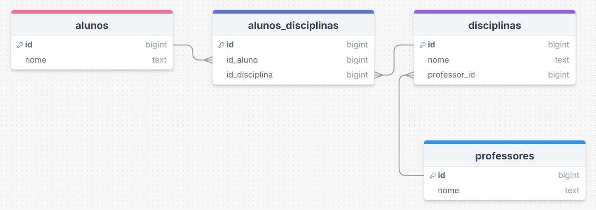

# 🔴 Exercícios Difíceis

## Exercício 7 — Pedido completo

Tabela inicial:

| pedido_id | cliente_nome | cliente_cidade | produto_nome | preco |
|---|---|---|---|---|
| 1 | João | Recife | Notebook | 4000 |
| 1 | João | Recife | Mouse | 50 |
| 2 | Maria | São Paulo | Teclado | 120 |

**1. Identifique as dependências funcionais**

O atributo `cliente_cidade` depende de `cliente_nome` e o atributo `preco` depende de `produto_nome`.

**2. Normalize até **3FN****

A tabela inicial é dividida em 4 tabelas (`Cidades`, `Clientes`, `Pedidos` e `Produtos`) para eliminar a presença de replicações desnecessárias de dados, bem como dependências funcionais parciais e dependências transitivas.

---

## Exercício 8 — Venda e vendedor

Tabela inicial:

| venda_id | vendedor_nome | loja_nome | loja_cidade |
|---|---|---|---|
| 1 | Carlos | Loja Centro | Recife |
| 2 | Carlos | Loja Centro | Recife |
| 3 | Ana | Loja Norte | São Paulo |

**1. Existe dependência transitiva?**

Sim, o atributo `loja_cidade` depende de `loja_nome`, o qual trata-se de um atributo não-chave.

**2. Como dividir as tabelas?**

A tabela inicial é dividida em duas tabelas (`Vendedores` e `Lojas`) para a eliminação de redundâncias e dependências transitivas, além disso, é criada a tabela `Vendas` para representar cada ocorrência de uma venda, relacionando vendedores e lojas por meio de chaves estrangeiras.

---

## Exercício 9 — Sistema de universidade

Tabela inicial:

| aluno_id | aluno_nome | disciplina | professor |
|---|---|---|---|
| 1 | Ana | Banco de Dados | Marcos |
| 2 | Pedro | Banco de Dados | Marcos |
| 3 | Ana | Redes | Carla |

**1. Existe relação N:N?**

Sim, pois uma disciplina pode possuir um ou vários alunos, assim como um aluno pode estar cursando uma ou várias disciplinas.

**2. Quais tabelas devem existir?**

A tabela inicial é dividida em 4 tabelas (`Alunos`, `Disciplinas`, `Professores` e `Alunos_Disciplinas`), evitando assim a replicação desnecessárias de dados e a presença de dependências funcionais e transitivas.

---

## Exercício 10 — Sistema de e-commerce

Tabela inicial:

| pedido_id | cliente_nome | cliente_email | produto_nome | categoria |
|---|---|---|---|---|
| 1 | João | joao@email.com | Notebook | Informática |
| 1 | João | joao@email.com | Mouse | Informática |
| 2 | Ana | ana@email.com | Geladeira | Eletrodomésticos |

**1. Identifique dependências funcionais**

O atributo `cliente_email` depende de `cliente_nome`, assim como o atributo `categoria` depende do atributo `produto_nome`.

**2. Normalize até 3FN**

Para normalizar essa tabela inicial, é necessário fragmentá-la em 4 tabelas (`Clientes`, `Pedidos`, `Produtos` e `Categorias`); dessa forma, são eliminadas as dependências funcionais e transitivas, bem como a ocorrência de replicações desnecessárias dos dados.

**3. Quais seriam as tabelas finais?**

`Clientes`, `Pedidos`, `Produtos` e `Categorias`.

