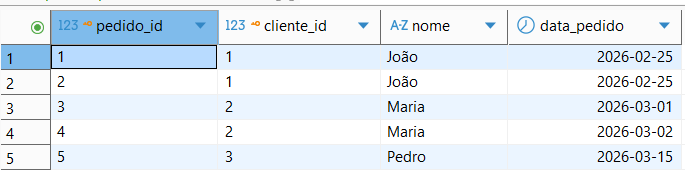
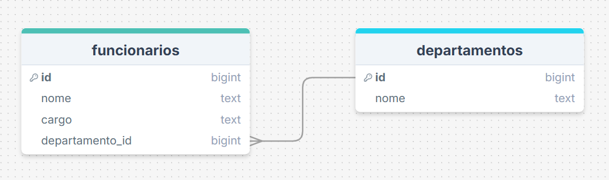
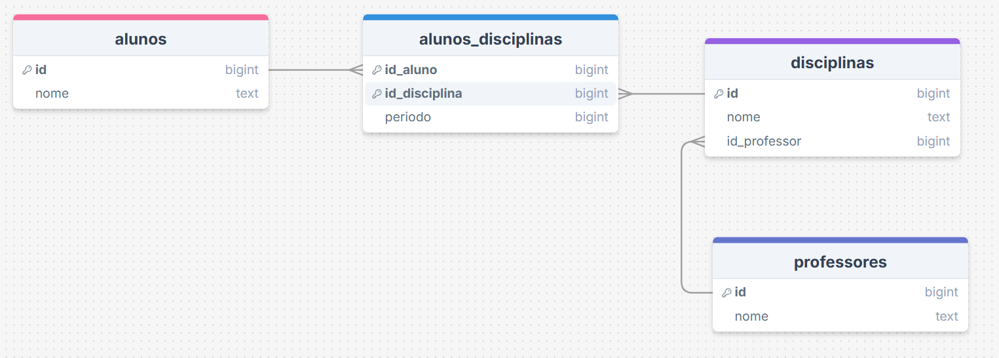
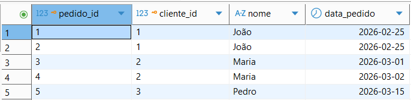
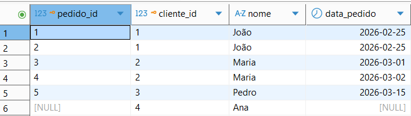

# 🧪 Tarefa 04 — Modelagem de Banco de Dados

Script para criar e conectar ao Banco de Dados 👇

```sql
CREATE DATABASE tarefa04;

\c tarefa04;
```

## 🟢 Exercício 1 — Cliente e Pedido

Cenário:

Um cliente pode fazer vários pedidos.

### Perguntas:

**1. Quais tabelas existem?**

As tabelas `Clientes` e `Pedidos`.

**2. Qual a cardinalidade?**

Cardinalidade **1-N** ou "Um para Muitos", pois um cliente pode realizar vários pedidos, mas cada pedido é feito por apenas um cliente.

**3. Defina PK e FK**

Como *Primary Keys* (Chaves Primárias) temos `Clientes(id)` e `Pedidos(id)`, como *Foreign Keys* (Chaves Estrangeiras) temos `Pedidos(id_cliente)`.

**4. Faça um INNER JOIN**

Fazendo uma consulta utilizando INNER JOIN no SELECT para retornar os pedidos de cada cliente.

```sql
SELECT p.id AS "pedido_id", c.id AS "cliente_id", c.nome, p.data_pedido FROM clientes c
INNER JOIN pedidos p
ON c.id = p.id_cliente;
```




---

## 🟢 Exercício 2 — Pedido e Produto

Cenário:

Um pedido pode ter vários produtos  
Um produto pode estar em vários pedidos

### Perguntas:

**1. Qual o tipo de relacionamento?**

Trata-se de um relacionamento do tipo **N-N** ou "Muitos para Muitos".

**2. Qual tabela intermediária criar?**

Como trata-se de um relacionamento do tipo **N-N**, é criada uma tabela intermediária/associativa chamada `Pedidos_Produtos` contendo como chaves estrangerias as chaves primárias (PKs) das tabelas `Produtos` e `Pedidos`. 

**3. Defina chave composta**

Chave Composta trata-se de uma chave primária que é composta por mais de um atributo, neste cenário podemos ter `id_produto` e `id_pedido` como atributos que compõem a chave composta da tabela `Pedidos_Produtos`.

**4. Monte as tabelas**

Podemos criar a tabela Produtos e a tabela intermediária/associativa entre Produtos e Pedidos (Pedidos_Produtos) utilizando o seguinte script SQL:

```sql
CREATE TABLE Produtos(
id SERIAL,
nome TEXT NOT NULL,
preco DECIMAL(10, 2) NOT NULL,
PRIMARY KEY (id)
);

CREATE TABLE Pedidos_Produtos(
id_produto INT NOT NULL,
id_pedido INT NOT NULL,
preco_compra DECIMAL(10, 2) NOT NULL,

    PRIMARY KEY (id_produto, id_pedido),
    CONSTRAINT fk_pedidos_produtos_produto
        FOREIGN KEY (id_produto)
        REFERENCES Produtos(id),
    CONSTRAINT fk_pedidos_produtos_pedido
        FOREIGN KEY (id_pedido)
        REFERENCES Pedidos(id)
);
```

Resultando no seguinte diagrama:


---

## 🟡 Exercício 3 — Funcionário e Departamento

Cenário:

Um funcionário pertence a um departamento  
Um departamento tem vários funcionários

### Perguntas:

**1. Qual a cardinalidade?**

Trata-se de uma cardinalidade **1-N** ou "Um para Muitos"/"Muitos para Um", pois um funcionário pertence unicamente a um departamento, enquanto cada departamento pode ter vários funcionários trabalhando nele. 

**2. Onde fica a FK?**

A Chave Estrangeira (*Foreign Key* - FK) fica na tabela que representa o "lado N" da relação, de acordo com as regras de cardinalidade. Portanto, teremos a FK `departamento_id` na tabela `Funcionarios`.

**3. Modele as tabelas**



A criação de ambas as tabelas é feita pelo seguinte script SQL:

```sql
CREATE TABLE Departamentos(
    id SERIAL,
    nome TEXT,
    PRIMARY KEY (id)
);

CREATE TABLE Funcionarios(
    id SERIAL,
    nome TEXT,
    cargo TEXT,
    departamento_id INT,
    PRIMARY KEY (id),
    CONSTRAINT fk_departamento_funcionarios
        FOREIGN KEY (departamento_id)
        REFERENCES Departamentos(id)
);
```

---

## 🟡 Exercício 4 — Índices

Cenário:

Tabela de pedidos com milhares de registros

### Perguntas:

**1. Em quais colunas você criaria índices?**

Criaria um índice para as colunas `id_cliente` e `data_pedido`.

**2. Por quê?**

porque ambas são colunas muito utilizadas em consultas ao banco de dados, garantindo assim uma performance melhor nas consultas.

---

## 🔴 Exercício 5 — Sistema Escolar

Cenário:

- Alunos fazem disciplinas
- Professores ministram disciplinas

### Perguntas:

**1. Identifique relacionamentos**

- Alunos cursam uma ou **várias** disciplinas, enquanto uma disciplina possui um ou **vários** alunos (N - N).
- Professores ministram uma ou várias disciplinas, enquanto uma disciplina é ministrada por um professor (1 - N).

**2. Existe N:N?**

Sim, entre as tabelas `Alunos` e `Disciplinas`, pois alunos podem cursar uma ou várias disciplinas, enquanto uma disciplina pode possuir um ou vários alunos.

**3. Quais tabelas criar?**

São criadas as tabelas `Alunos`, `Disciplinas`, `Professores` e a tabela intermediária/associativa `Alunos_Disciplinas`.

**4. Monte o DER (imagem)**



---

## 🔴 Exercício 6 — Joins

Dadas as tabelas:

Clientes  
Pedidos

### Perguntas:

1. **Faça:**
    - **INNER JOIN**
    - **LEFT JOIN**

Consulta com INNER JOIN:

```sql
SELECT p.id AS pedido_id, c.id AS cliente_id, c.nome, p.data_pedido
FROM clientes c
INNER JOIN pedidos p
ON c.id = p.id_cliente;
```



Consulta com LEFT JOIN:

```sql
SELECT p.id AS pedido_id, c.id AS cliente_id, c.nome, p.data_pedido
FROM clientes c
LEFT JOIN pedidos p
ON c.id = p.id_cliente;
```



2. **Explique a diferença**

O `INNER JOIN` retorna apenas os registros que possuem correspondência entre ambas as tabelas consultadas. O `LEFT JOIN`, por sua vez, retorna todos os registros da tabela da esquerda, além dos campos da tabela da direita, mas preenchenco com `NULL` onde não houver correspondência. 

---